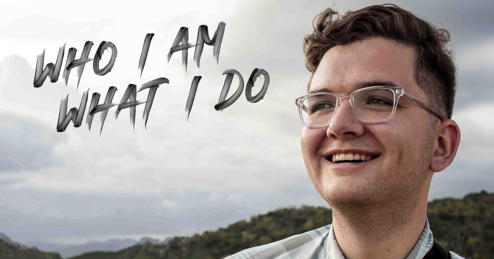

# Portfolio

## Who I Am and What I Do.
<hr>

  [](https://github.com/tdmoore004)
  [](https://github.com/tdmoore004/tdmoore004.github.io)
  [](https://github.com/tdmoore004/tdmoore004.github.io)
  [](https://choosealicense.com/licenses/mit/)
  [](https://nodejs.org/en/)
  [](https://www.npmjs.com/package/inquirer)

  ## Table of Content
  * [ Description ](#Description)
  * [ Project Links ](#Project-Links)
  * [ Screenshots ](#Screenshots)
  * [ Project Objective ](#Project-Objective)
  * [ Built With ](#Built-With)
  * [ Credits and Reference ](#Credits-and-Reference)
  * [ Author Contact ](#Author-Contact)
  * [ License ](#License)
  #

  ## Description
  See more about who I am and what I do. Utilizing React, my portfolio highlights my past work as well as the skills and knowledge that I have learned throughout my past work and education. Check out some of the projects that I have worked on and the skills and knowledge that I have and can bring to any future work or projects.

  ##  Project Links

  ##### Deployed site: https://www.tannerdmoore.com/
  
  ##### Github Repo link:  https://github.com/tdmoore004/tdmoore004.github.io

  ## Screenshots
  <kbd></kbd>
  
  ## Project Objective
  * To create a one stop location for highlighting all of my past projects and the skills and knowledge that I contribute. 
  * It uses React, and Foundation CSS framework.
  * It features a mobile-first, clean and polished user interface and adapts to multiple screen sizes.
  
  ## Built With 
  ```
  React, Foundation CSS
  ```
  
  ## Credits and Reference
  The following links have helped us with this project. <br> [React](https://reactjs.org/) <br> [Foundation CSS](https://get.foundation/)

  ## Author Contact
  Contact the author with any questions!
  Github link: [tdmoore004](https://github.com/tdmoore004)

  ## License
  This project is [MIT](https://choosealicense.com/licenses/mit/) licensed.

   Copyright © 2021 [Tanner Moore](https://github.com/tdmoore004)

  <hr>
  <p align='center'><i>
  Built by <a href="https://github.com/tdmoore004"> Tanner Moore</a>
</i></p>